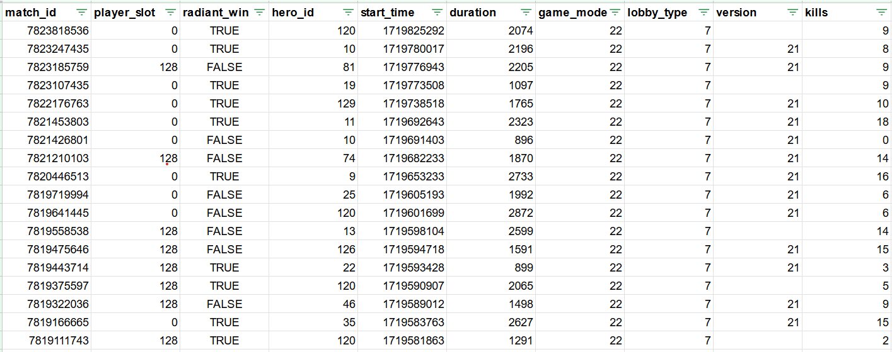

`<a id="readme-top"></a>`

[Contributors][contributors-url]
[Forks][forks-url]
[Stargazers][stars-url]
[Issues][issues-url]
[MIT License][license-url]
[LinkedIn][linkedin-url]

<!-- PROJECT LOGO -->

<br />
<div align="center">
  <a href="https://github.com/chasimm3/dota_project">
    
  </a>

<h3 align="center">OpenDota Data Warehouse</h3>

<p align="center">
An all in one data warehouse utilising the API provided by OpenDota.com. 
    <br />
    <a href="https://github.com/chasimm3/dota_project"><strong>Explore the docs »</strong></a>
    <br />
    <br />
    ·
    <a href="https://github.com/chasimm3/dota_project/issues/new?labels=bug&template=bug-report---.md">Report Bug</a>
    ·
    <a href="https://github.com/chasimm3/dota_project/issues/new?labels=enhancement&template=feature-request---.md">Request Feature</a>
  </p>
</div>

<!-- TABLE OF CONTENTS -->

<details>
  <summary>Table of Contents</summary>
  <ol>
    <li>
      <a href="#about-the-project">About The Project</a>
    </li>
    <li>
      <a href="#getting-started">Getting Started</a>
      <ul>
        <li><a href="#prerequisites">Prerequisites</a></li>
        <li><a href="#installation">Installation</a></li>
      </ul>
    </li>
    <li><a href="#usage">Usage</a></li>
    <li><a href="#roadmap">Roadmap</a></li>
    <li><a href="#contributing">Contributing</a></li>
    <li><a href="#license">License</a></li>
    <li><a href="#contact">Contact</a></li>
    <li><a href="#acknowledgments">Acknowledgments</a></li>
  </ol>
</details>

<!-- ABOUT THE PROJECT -->

## About The Project

<br />
<div align="center">
  <a href="https://github.com/chasimm3/dota_project">
    
  </a>
 </div>

An example of the data structure within the Matches fact table.

<!-- GETTING STARTED -->

## Getting Started

When executed, the script will execute some GET API calls against the OpenDota API. It will stage the json data in a series of staging folders, then transform the data into a Kimball dimensional model.

Currently there are 3 dimensions and 1 fact table in the model, this are Dim_Player, Dim_Item, Dim_Hero, and Fact_Matches. Dim_Hero and Dim_Item currently

To get started with this repository, start by cloning the repo onto your machine. From there the code can be executed immediately with default configuration, which is as follows:

**Staging Folder**

The file path of config.py appended with Staging/.

**Tables Folder**

The file path of config.py appended with Tables/

**Output file type**

The default file type is xlsx.

**Output into single excel file**

The default is set to true.

### Prerequisites

A basic knowledge of running python code, including change parameters before execution. This is best done in an IDE such as VSCode.

Ensure that you have pip installed and are upgraded to the latest version.

##### Windows:

```py
  py -m ensurepip --upgrade
```

##### Linux:

```py
  python -m ensurepip --upgrade
```

##### MacOS

```py
  python -m ensurepip --upgrade
```

### Installation

UNFINISHED:

1. 
2. Clone the repo
   ```sh
   git clone https://github.com/chasimm3/dota_project.git
   ```

<p align="right">(<a href="#readme-top">back to top</a>)</p>

<!-- USAGE EXAMPLES -->

## Usage

The primary use of this project should be for data analysis of trends of professional dota players. The data can be connected to any data analysis tool (e.g. PowerBi, Jupyter etc) to enable in-depth analysis of the hero choice and item choice impact upon win probability.

_For more examples, please refer to the [Documentation](https://example.com)_

<p align="right">(<a href="#readme-top">back to top</a>)</p>

## API Usage Limits

As the code utilises the free API provided by OpenDota.com, it is as such limited to:

- 60 requests per min
- 2,000 requests per day

There are currently no plans to include a premium option, if you would like this functionality added feel free to raise a feature-request at: https://github.com/chasimm3/dota_project/issues/new?labels=enhancement&template=feature-request---.md

<!-- ROADMAP -->

## Roadmap

- [ ] Enable choice of output file type, currently the only available structure is .csv.
  - [X] Parquet
  - [ ] Json
  - [X] xlsx
- [ ] Import additional data from the API, including in-depth match stats.
- [ ] Build up a suite of PowerBI reports to get the ball rolling for the users.

See the [open issues](https://github.com/chasimm3/dota_project/issues) for a full list of proposed features (and known issues).

<p align="right">(<a href="#readme-top">back to top</a>)</p>

<!-- CONTRIBUTING -->

## Contributing

Contributions are what make the open source community such an amazing place to learn, inspire, and create. Any contributions you make are **greatly appreciated**.

If you have a suggestion that would make this better, please fork the repo and create a pull request. You can also simply open an issue with the tag "enhancement".
Don't forget to give the project a star! Thanks again!

1. Fork the Project
2. Create your Feature Branch (`git checkout -b feature/AmazingFeature`)
3. Commit your Changes (`git commit -m 'Add some AmazingFeature'`)
4. Push to the Branch (`git push origin feature/AmazingFeature`)
5. Open a Pull Request

<p align="right">(<a href="#readme-top">back to top</a>)</p>

<!-- LICENSE -->

## License

Distributed under the MIT License. See `LICENSE.txt` for more information.

<p align="right">(<a href="#readme-top">back to top</a>)</p>

<!-- CONTACT -->

## Contact

Charlie Simmons - charlie.simmons92@gmail.com.com

Project Link: [https://github.com/chasimm3/dota_project](https://github.com/chasimm3/dota_project)

<p align="right">(<a href="#readme-top">back to top</a>)</p>

<!-- ACKNOWLEDGMENTS -->

## Acknowledgments

* []() OpenDota for providing a free to use API.

<p align="right">(<a href="#readme-top">back to top</a>)</p>

<!-- MARKDOWN LINKS & IMAGES -->

<!-- https://www.markdownguide.org/basic-syntax/#reference-style-links -->

[contributors-shield]: https://img.shields.io/github/contributors/chasimm3/dota_project.svg?style=for-the-badge
[contributors-url]: https://github.com/chasimm3/dota_project/graphs/contributors
[forks-shield]: https://img.shields.io/github/forks/chasimm3/dota_project.svg?style=for-the-badge
[forks-url]: https://github.com/chasimm3/dota_project/network/members
[stars-shield]: https://img.shields.io/github/stars/chasimm3/dota_project.svg?style=for-the-badge
[stars-url]: https://github.com/chasimm3/dota_project/stargazers
[issues-shield]: https://img.shields.io/github/issues/chasimm3/dota_project.svg?style=for-the-badge
[issues-url]: https://github.com/chasimm3/dota_project/issues
[license-shield]: https://img.shields.io/github/license/chasimm3/dota_project.svg?style=for-the-badge
[license-url]: https://github.com/chasimm3/dota_project/blob/master/LICENSE.txt
[linkedin-shield]: https://img.shields.io/badge/-LinkedIn-black.svg?style=for-the-badge&logo=linkedin&colorB=555
[linkedin-url]: https://www.linkedin.com/in/charlie-simmons-25a25599/
[product-screenshot]: images/screenshot.png
